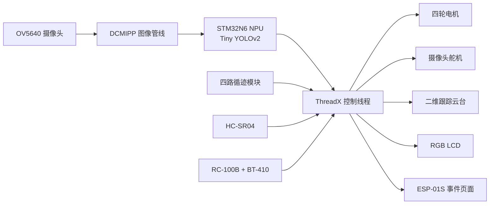

<!-- CODEX 2026-08-26: Added the initial repository overview from the current firmware and the earlier project document. -->

# 基于 STM32N647 的边缘 AI 巡防机器人

本项目是一套运行在正点原子 STM32N647 开发板上的四轮巡防机器人固件。机器人使用 OV5640 获取图像，通过 STM32N6 的 NPU 在端侧完成人体检测，并结合循迹、超声波避障、舵机云台、人工遥控和 ESP-01S 事件页面，实现自动巡防与人工接管。

> 仓库中的源码是当前功能的唯一准确信息来源。早期设计文档《基于边缘 AI 与多传感融合的主动防御型巡防机器人》仅作为项目背景参考，其中部分参数、流程和实验数据已经过时。

## 主要功能

- **端侧人体检测**：运行 `224 x 224` INT8 Tiny YOLOv2 模型，不依赖云端完成推理。
- **自动循迹**：四路红外循迹模块识别黑线，短暂遇到全白区域时保持上一次有效动作，过滤瞬时干扰和断线。
- **超声波避障**：自动模式进入避障状态；人工模式保留近距离紧急停车保护。
- **双级视觉跟踪**：摄像头安装在水平舵机上，激光指示模块安装在二维云台上；云台跟踪会补偿摄像头自身的水平转角。
- **人工遥控**：通过 ROBOTIS RC-100B 与 BT-410 从模块控制行驶、摄像头转向和激光指示。
- **事件快照**：检测到的人离开画面后，从该次事件中保留置信度最高的一帧，通过 ESP-01S 页面供手机查看。
- **本地显示与故障恢复**：RGB LCD 实时显示画面和状态，并对摄像头取帧异常进行超时恢复。

## 系统组成



### 硬件清单

| 模块 | 用途 |
| --- | --- |
| 正点原子 STM32N647 开发板 | 主控、NPU 推理和多任务调度 |
| OV5640 | 视频采集 |
| SG90 舵机 | 摄像头水平扫描，俯仰角机械固定 |
| 二维舵机云台 | 跟随人体目标并控制指示方向 |
| 四个直流电机及驱动模块 | 四轮差速行驶 |
| 四路红外循迹模块 | 黑线检测 |
| HC-SR04 | 前方距离检测和紧急停车 |
| RGB LCD | 实时画面与运行状态显示 |
| ESP-01S | 建立本地 Wi-Fi 和 HTTP 事件页面 |
| RC-100B + BT-410 从模块 | 人工遥控输入 |
| 蜂鸣器、低功率激光指示模块 | 告警与目标指示 |

## 工作模式

自动模式由状态机调度：

| 状态 | 主要行为 |
| --- | --- |
| `STATE_PATROL` | 自动循迹，摄像头扫描，持续进行人体检测和距离检测 |
| `STATE_AVOID` | 前方出现障碍物时停车并执行避障动作 |
| `STATE_WARNING` | 确认人体目标后停车、蜂鸣提示并进行视觉跟踪 |
| `STATE_COMBAT` | 保持目标跟踪并输出激光指示 |

人工模式会关闭自动循迹、自动避障状态机和蜂鸣器。二维云台仍根据 AI 检测结果自动跟踪，前方距离小于 `20 cm` 时禁止继续向前。

### RC-100B 按键

| 按键 | 功能 |
| --- | --- |
| `6` | 进入人工模式并立即停车 |
| `5` | 退出人工模式，停车并重置为 `STATE_PATROL` |
| 上 / 下 | 前进 / 后退 |
| 左 / 右 | 原地左转 / 原地右转 |
| 上 + 左 / 上 + 右 | 缓慢转向 |
| `2` / `4` | 摄像头舵机左转 / 右转 |
| 按住 `1` | 开启激光指示，松开即关闭 |
| 松开方向键 | 立即停车 |

超过 `500 ms` 没有收到有效遥控数据时，机器人会停车并关闭激光指示。

## 查看事件快照

1. 手机连接 Wi-Fi：`Robot_Cam`
2. 密码：`12345678`
3. 浏览器访问：`http://192.168.4.1/`
4. 点击网页中的“刷新日志”查看最新事件和图片。

当前实现会在一次人体事件结束后发布该事件中置信度最高的快照。网页和图片分开传输，以降低 ESP-01S 串口与 HTTP 发送压力。

> 当前页面只保存**最近一次事件**，图片位于 MCU 内存中，设备复位或断电后会丢失；它不是带文件系统、实时时钟和历史检索能力的持久化日志。ESP-01S 工作在本地 AP 模式，页面默认仅能由连接该热点的设备访问。

## 当前关键参数

| 参数 | 当前值 | 位置 |
| --- | ---: | --- |
| AI 置信度阈值 | `0.80` | `Appli/Core/Inc/app_config.h` |
| 连续人体确认帧数 | `4` | `Appli/Core/Src/app.c` |
| 连续目标丢失帧数 | `8` | `Appli/Core/Src/app.c` |
| 摄像头帧超时 | `2000 ms` | `Appli/Core/Src/app.c` |
| 遥控链路超时 | `500 ms` | `Appli/Core/Src/app.c` |
| 人工模式前向急停距离 | `20 cm` | `Appli/Core/Src/app.c` |
| 循迹码型确认次数 | `2` | `Drivers/BSP/MOTOR/find.c` |
| 全白丢线动作保持 | `3000 ms` | `Drivers/BSP/MOTOR/find.c` |

上述值与舵机方向补偿、死区和速度均需要根据车体安装误差、场地光照及目标距离重新标定。

## 代码结构

```text
.
├─ Appli/Core/              应用入口、AI 后处理、状态机和任务调度
├─ Drivers/BSP/MOTOR/       电机、循迹、超声波、舵机云台和蜂鸣器
├─ Drivers/BSP/ESP01S/      ESP-01S AT 通信、HTTP 请求解析与事件页面
├─ Drivers/BSP/RC100/       RC-100B 数据帧解析和 USART1 接收
├─ Model/                   Tiny YOLOv2 模型及 STM32N6 生成网络文件
├─ Middlewares/AI/          STM32N6 NPU 运行时
├─ Middlewares/ThreadX/     ThreadX 实时操作系统
└─ Utilities/lcd/           LCD 显示支持
```

## 编译与下载

本工程使用 STM32CubeIDE，工程入口为 `Appli/.project`。`.cproject` 还会引用仓库上级软件包中的 STM32N6 HAL/CMSIS 文件，因此只下载本仓库并不能保证独立编译。

推荐保持以下目录关系：

```text
Software_Package/
├─ STM32Cube_FW_N6_V1.0.0/
└─ Projects/99_Applications/Code/   # 本仓库
```

1. 准备正点原子 STM32N647 对应的软件包和 `STM32Cube_FW_N6_V1.0.0`。
2. 在 STM32CubeIDE 中选择 **Import Existing Projects into Workspace**，导入 `Appli`。
3. 选择 `Debug` 或 `Release` 配置并编译。
4. 按开发板的软件包说明完成应用镜像下载和启动配置。

模型文件已经位于 `Model/`。如果替换模型，需要同步重新生成 NPU 网络文件，并检查输入尺寸、类别数量和后处理配置。

## 当前限制与后续方向

- 事件页面只保存一条内存快照，尚未实现 SD 卡、Flash 或云端持久化。
- 事件时间使用设备运行时长，不是日期时间；可增加 RTC/NTP 时间戳。
- ESP-01S 的 UART 带宽有限，大图传输仍可能较慢；可改用更高波特率、分块缓存，或升级为带摄像头/网络栈的协处理器。
- 单目摄像头与二维云台存在安装偏差和距离相关视差，边缘位置需要分别标定补偿参数。
- 自动循迹、避障距离、舵机速度和视觉死区应在实际场地完成回归测试。

## 使用提醒

这是面向实验和竞赛验证的原型工程。测试前应架空车轮检查电机方向，并为电机、舵机和 ESP-01S 提供稳定电源。激光模块仅用于低功率目标指示，任何情况下都不应朝向人眼。

仓库包含 ST、ThreadX、正点原子及其他第三方组件，相关文件继续遵循各自原始许可；本仓库目前未另行声明统一的开源许可证。
